# Tecnicas Digitales G3-E2

Técnicas Digitales - Grupo 3 Equipo 2

## Descripción
Este es el repositorio de la asignatura tecnicas digitales.

## Integrantes

* [Ivan Eduardo Beltran Prieto]
(https://github.com/ivanedbeltranpr-star)
* [Cristian Camilo Romero Contreras]
(https://github.com/cristiancaromeroco-dotcom)
* [Sebastian Ferney Gutierrez Mondragón]
(https://github.com/sebastianfegutierrezmo-ops)

# Informe

Indice:

1. [Compuertas](#Compuertas)
2. [Verificador de numeros primos](#verificador-de-numeros-primos)
3. [Sumador de 1 bit](#sumador-de-1-bit)
4. [Simulaciones](#simulaciones)
5. [Evidencias de implementación](#evidencias-de-implementación)
6. [Conclusiones](#conclusiones)

## Documentación del diseño implementado

## 1. Compuertas

#### 1.1 Descripción

AND: Produce un nivel alto (1) solo si ambas señales de entrada (A y B) están activas en 1 simultáneamente.

NOT: Invierte el valor lógico que recibe; un valor de 1 a la entrada resulta en un 0 a la salida, e igualmente un valor de 0 cambia a 1.

OR(O): Entrega un resultado de 1 si cualquiera de las entradas (A, B o ambas) presenta un estado lógico 1.

XNOR: Mantiene la salida en 1 exclusivamente si las entradas A y B poseen exactamente la misma condición lógica.

XOR: Genera una salida en 1 únicamente cuando las señales de entrada A y B tienen estados lógicos distintos.

#### 1.2 Diagramas

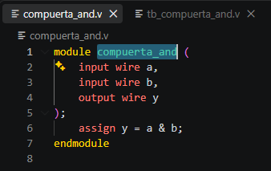
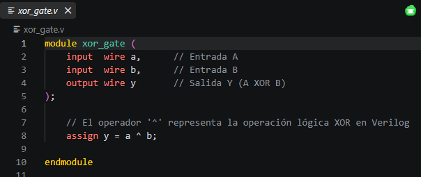
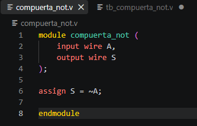
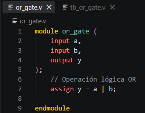
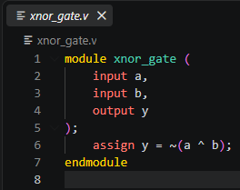

## 2. Verificador de Numeros Primos

#### 2.1 Descripción

Se trata de un sistema digital combinacional diseñado con tres variables de entrada (A, B y C), las cuales integran un dato numérico en formato binario. El valor equivalente en base decimal depende de la posición de cada bit: $A$ representa el valor de mayor peso ($2^2 = 4$), $B$ equivale a la posición intermedia ($2^1 = 2$) y $C$ es el bit menos significativo ($2^0 = 1$), obteniendo el total mediante la relación $A \cdot 4 + B \cdot 2 + C \cdot 1$. El propósito del circuito es analizar dicha cantidad y generar un valor lógico alto ($S = 1$) siempre que la cifra calculada sea un número primo.

Caso práctico: Si las señales ingresan como $A=1$, $B=0$ y $C=1$, el resultado equivale a $1 \cdot 4 + 0 \cdot 2 + 1 \cdot 1 = 5$. Al ser el 5 un entero primo, la salida del circuito responderá activándose en $S = 1$.

#### 2.2 Diagramas
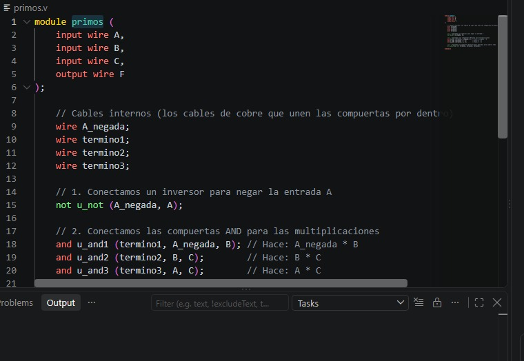

## 3. Sumador de 1 bit

#### 3.1 Descripción

Es un módulo digital combinacional encendido para procesar la adición de un par de bits (A y B) en conjunto con un bit de acarreo previo ($C_i$). Como resultado, entrega dos señales: $S$, correspondiente al resultado directo de la suma, y $C_o$, que transmite el acarreo saliente hacia la etapa o posición superior.

## Simulaciones

### 1. Simulacion de compuertas
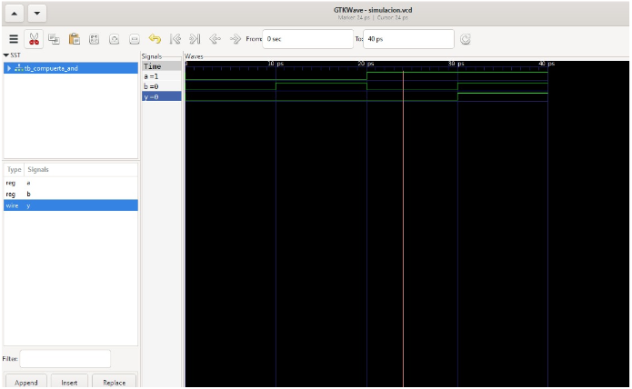
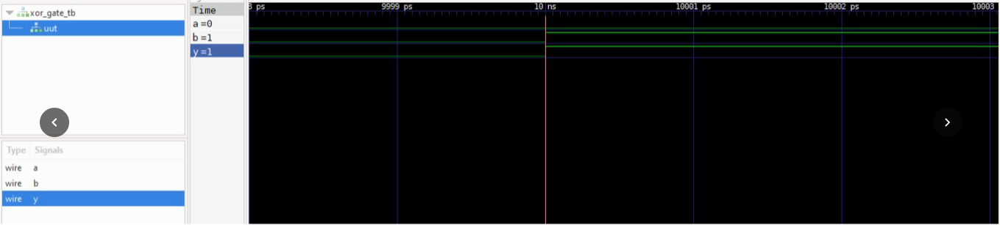
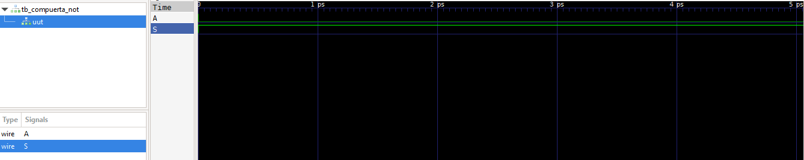
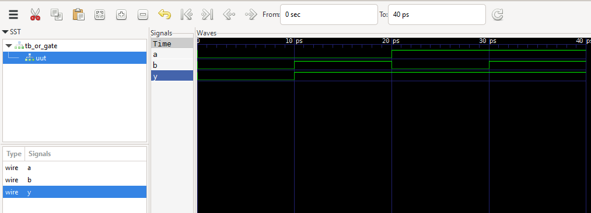
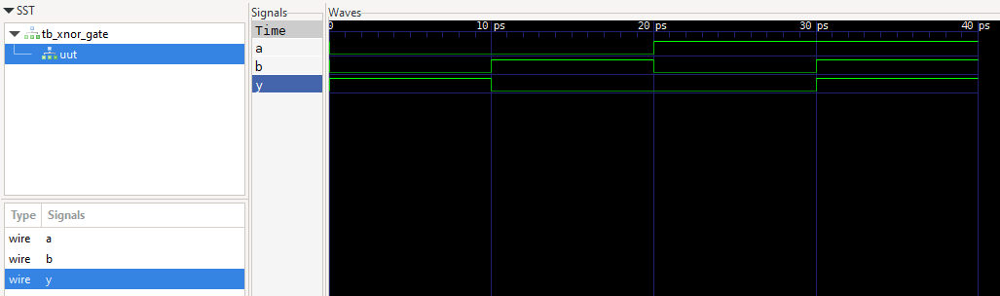

### 2. Simuacion de verificador de Numeros Primos
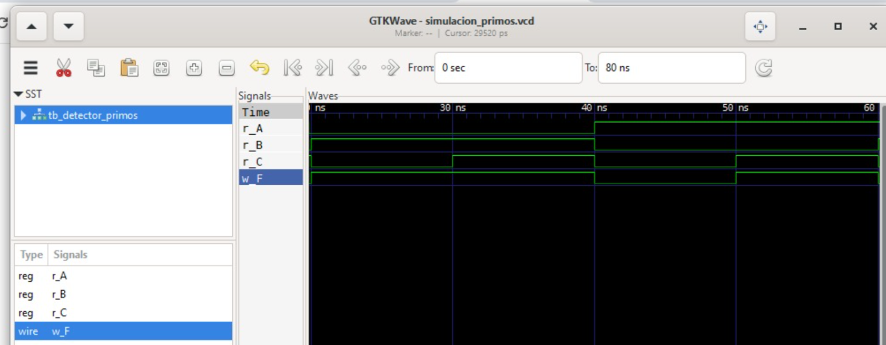

### 3. Simulacion de Sumador de 1 bit 
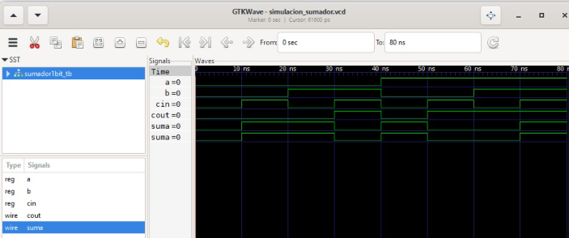  

## Codigos En Visual

### Compuertas
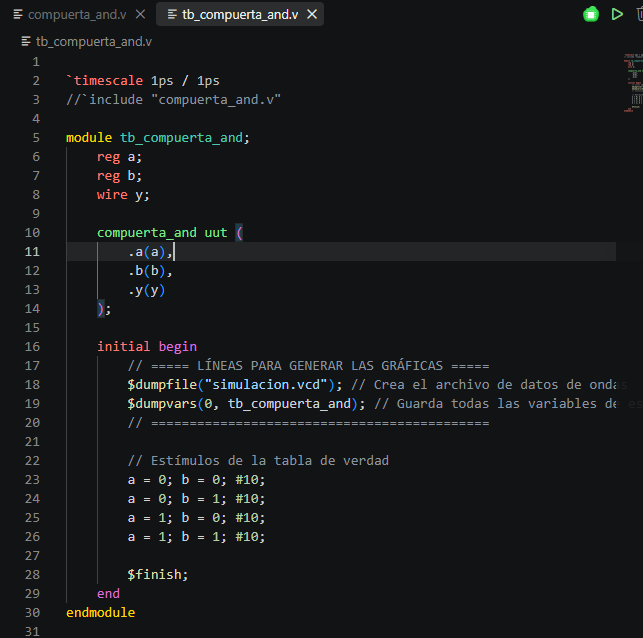
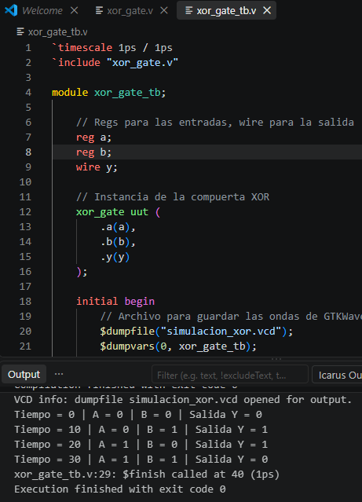
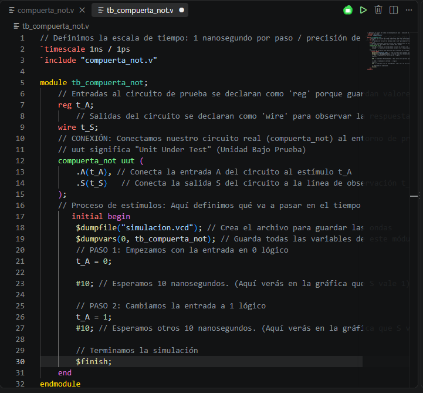
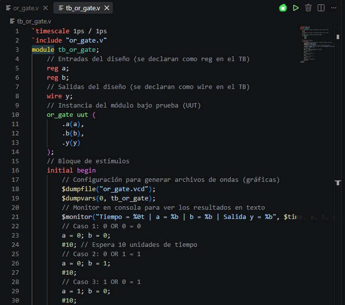
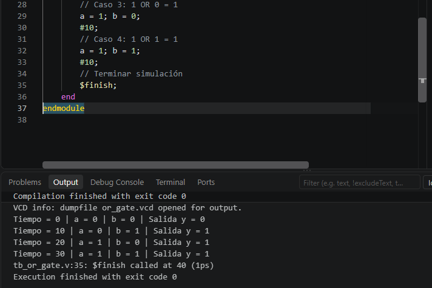
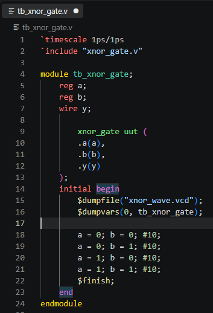

### Verificador De Numeros Primos
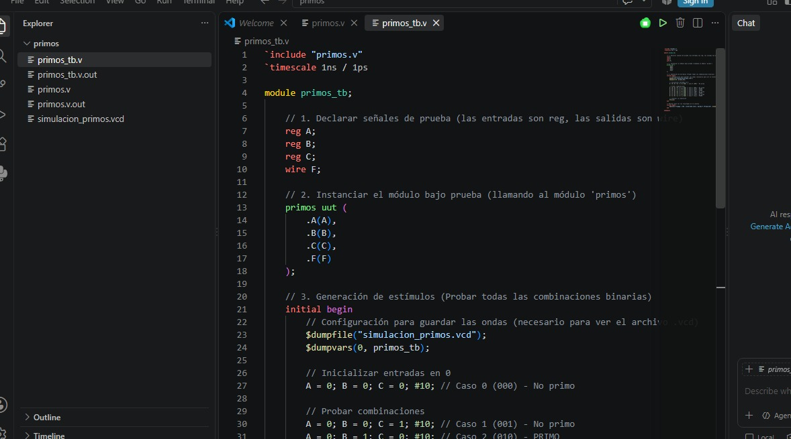

### Sumador De 1 Bit 
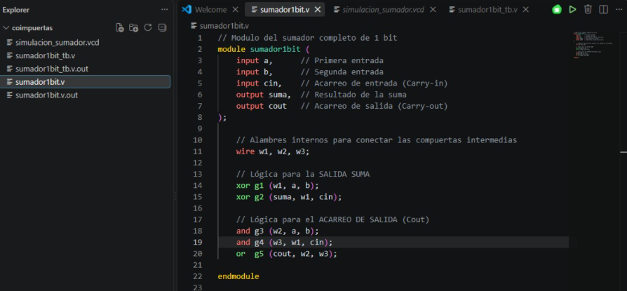

## Evidencias De Implementacion

[Compuertas]
(https://youtube.com/shorts/VRBLdVCifJQ?si=eIwbnneUCkzF0Av2)

## Conclusiones

Compuertas lógicas: Se verificó el funcionamiento de OR, AND, NOT, XOR y XNOR comparando sus tablas de verdad con las simulaciones en Verilog.

Aplicación práctica: Diseñar en Verilog permitió llevar la teoría de lógica booleana a la práctica y comprobar las salidas de cada circuito.

Detector de primos: Se comprobó cómo usar lógica combinacional para tomar decisiones, identificando números primos entre el 0 y el 7.

Sumador de 1 bit: Se entendió el manejo de la suma y el acarreo, componente clave para operaciones aritméticas más complejas.

Uso de Verilog: La práctica reforzó el uso del lenguaje de descripción de hardware para simular y analizar sistemas digitales.

## Referencias

IEEE. (2001). Lenguaje de descripción de hardware Verilog estándar IEEE (IEEE Std 1364-2001). Instituto de Ingenieros Eléctricos y Electrónicos. Esta norma define el lenguaje Verilog HDL para el desarrollo, verificación, síntesis y prueba de diseños electrónicos.

Ícaro Verilog. (sf). Documentación de Ícaro Verilog. Documentación oficial sobre compilación, simulación y uso de Verilog, incluyendo herramientas para visualizar formas de onda. Documentación de Ícaro Verilog

