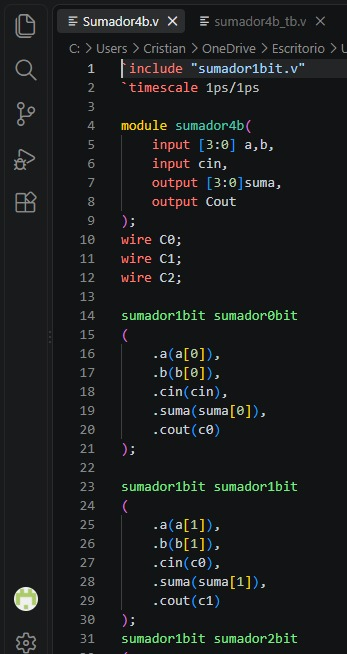
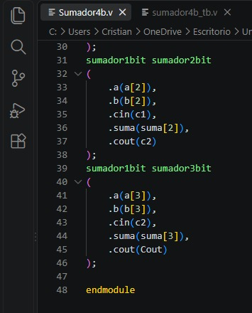
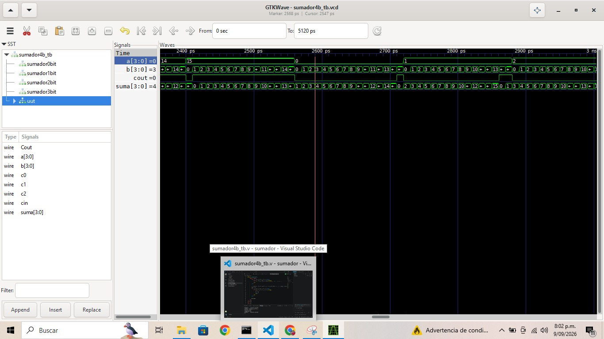
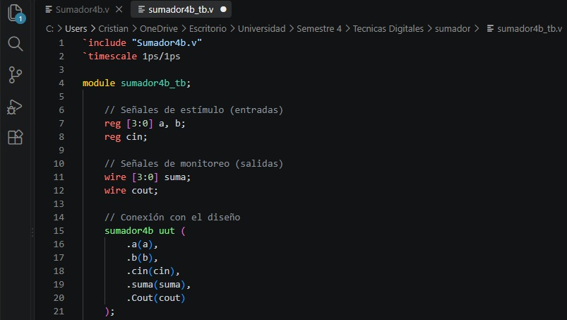
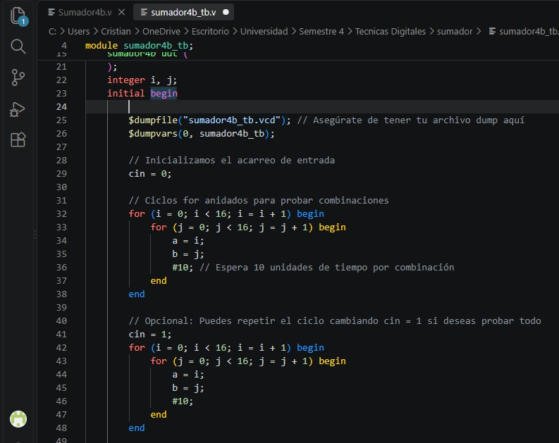
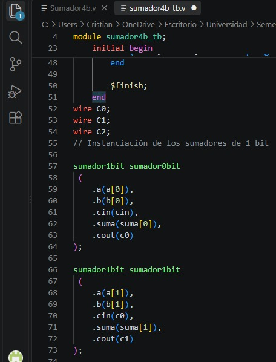
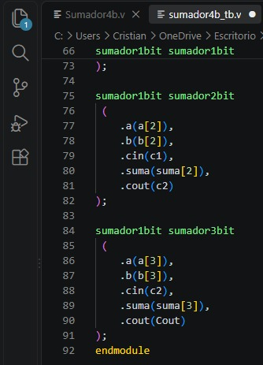

# Tecnicas Digitales G3-E2

Técnicas Digitales - Grupo 3 Equipo 2

## Descripción
Este es el repositorio de la asignatura tecnicas digitales.

## Integrantes

* [Ivan Eduardo Beltran Prieto]
(https://github.com/ivanedbeltranpr-star)
* [Cristian Camilo Romero Contreras]
(https://github.com/cristiancaromeroco-dotcom)
* [Sebastian Ferney Gutierrez Mondragón]
(https://github.com/sebastianfegutierrezmo-ops)

# Informe

Indice:

1. [Sumador de 4 bits](#sumador-de-4-bits)
2. [Simulaciones](#simulaciones)
3. [Evidencias de implementación](#evidencias-de-implementación)
4. [Conclusiones](#conclusiones)

## Documentación del diseño implementado

## 1. Sumador de 4 bits

#### 1.1 Descripción

Es un módulo digital combinacional diseñado para procesar la adición de dos palabras binarias de 4 bits cada una (\(A\) y \(B\)), en conjunto con un bit de acarreo de entrada inicial (\(C_{in}\)). Como resultado, entrega una palabra de 4 bits correspondiente al resultado directo de la suma (\(S\)), y un bit de acarreo saliente final (\(C_{out}\)), que transmite el desborde hacia una etapa o posición superior.

En la siguiente imagen se evidencia la implementación del código fuente en Verilog para un sumador estructural de 4 bits. En el diseño se puede observar el uso de la metodología modular, donde se conectan en cascada cuatro sumadores individuales de 1 bit para conformar el sistema completo:

En las primeras líneas se definen las entradas principales correspondientes a los dos vectores. Se evidencia la declaración de señales internas mediante cables (wire C0, C1, C2). Estas variables tienen la función de propagar el acarreo.

## Simulaciones

### 1. Simulacion De Sumador De 4 Bits 
En la siguiente imagen se evidencia la simulación temporal del módulo sumador de 4 bits mediante el software GTKWave, utilizando los resultados generados por el banco de pruebas (testbench). En las gráficas temporales se puede observar el comportamiento dinámico del circuito combinacional ante diferentes estímulos de entrada.

## Codigos En Visual

En las siguientes imágenes se evidencia la estructura completa y la lógica de validación para el banco de pruebas (testbench) del sumador de 4 bits (sumador4b_tb.v). El código permite verificar el comportamiento del diseño mediante la generación automática de estímulos temporales:Configuración y Conexión del Módulo (UUT): En la primera sección se observa la declaración de registros (reg) para manejar los estímulos de entrada y cables (wire) para monitorear las salidas.

Se evidencia la implementación de bloques initial y ciclos anidados for que iteran las variables enteras i y j desde 0 hasta 15. Esta lógica permite evaluar de manera automatizada las 256 combinaciones matemáticas posibles entre los dos vectores de entrada, repitiendo el proceso tanto para un acarreo inicial cin = 0 como para cin = 1.

## Evidencias De Implementacion

[Sumador de 4 bits]
(https://youtube.com/shorts/q10I84cNXOU?feature=share)

## Conclusiones

* El diseño estructural facilitó la reutilización de bloques independientes.
* La simulación gráfica validó el comportamiento lógico del sistema.
* El módulo procesó adecuadamente los desbordes numéricos binarios.
* Los ciclos anidados aseguraron una verificación exhaustiva completa.
* El banco de pruebas automatizado optimizó el tiempo de diagnóstico.

## Referencias

IEEE. (2001). Lenguaje de descripción de hardware Verilog estándar IEEE (IEEE Std 1364-2001). Instituto de Ingenieros Eléctricos y Electrónicos. Esta norma define el lenguaje Verilog HDL para el desarrollo, verificación, síntesis y prueba de diseños electrónicos.

Ícaro Verilog. (sf). Documentación de Ícaro Verilog. Documentación oficial sobre compilación, simulación y uso de Verilog, incluyendo herramientas para visualizar formas de onda. Documentación de Ícaro Verilog

