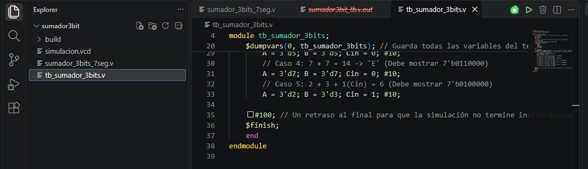
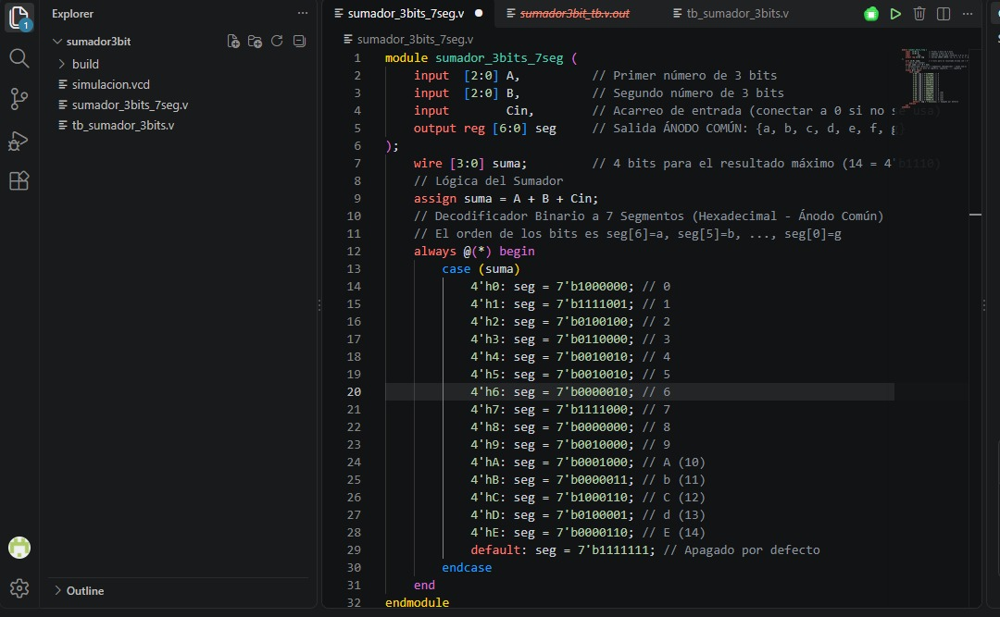
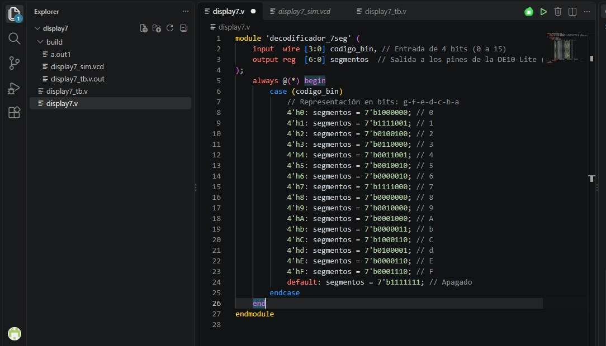

# Tecnicas Digitales G3-E2

Técnicas Digitales - Grupo 3 Equipo 2

## Descripción
Este es el repositorio de la asignatura tecnicas digitales.

## Integrantes

* Ivan Eduardo Beltran Prieto
(https://github.com/ivanedbeltranpr-star)
* Cristian Camilo Romero Contreras
(https://github.com/cristiancaromeroco-dotcom)
* Sebastian Ferney Gutierrez Mondragón
(https://github.com/sebastianfegutierrezmo-ops)

# Informe

Indice:

1. [Sumador de 3 bits](#sumador-de-3-bits)
2. [Display 7 segmentos](#Display-7-segmentos)
3. [Simulaciones](#simulaciones)
4. [Evidencias de implementación](#evidencias-de-implementación)
5. [Conclusiones](#conclusiones)

## Documentación del diseño implementado

## 1. Sumador de 3 bits

#### 1.1 Descripción

El archivo adjunto muestra un banco de pruebas o testbench en Verilog diseñado exclusivamente para simular y validar el comportamiento de un sumador de 3 bits. El código define los registros de entrada necesarios para los dos sumandos binarios de tres bits (A y B) junto al acarreo de entrada (Cin), así como un cable bus de salida de 7 bits (seg) encargado de recibir el resultado de la operación. Posteriormente, se realiza la instanciación de la Unidad Bajo Prueba (UUT), enlazando de forma directa estas señales del entorno de simulación con los puertos físicos del circuito modular del sumador.

  
  

## 1.2 Módulo Decodificador de 7 Segmentos

#### 1.1 Descripción

El código implementado en Verilog describe el comportamiento de un circuito combinacional encargado de decodificar una entrada binaria de 4 bits para controlar un display de 7 segmentos en una tarjeta de desarrollo como la FPGA.

##### Puertos de Entrada y Salida:
• El módulo recibe un vector de entrada de 4 bits (codigo_bin), lo que permite un rango de 16 combinaciones posibles (del 0 al 15 en base diez).
• Dispone de un vector de salida tipo registro de 7 bits (segmentos), donde cada bit está asignado a un led específico del display siguiendo el orden conceptual g-f-e-d-c-b-a.:
• El módulo recibe un vector de entrada de 4 bits (codigo_bin), lo que permite un rango de 16 combinaciones posibles (del 0 al 15 en base diez).
• Dispone de un vector de salida tipo registro de 7 bits (segmentos), donde cada bit está asignado a un led específico del display.
• Estructura de Decodificación y Actuación:
A través de una sentencia case, el sistema evalúa la entrada binaria y asigna el patrón correspondiente en el display. El diseño opera bajo lógica negativa (ánodo común), lo que significa que un bit en 0 enciende el segmento y un bit en 1 lo apaga.

  

